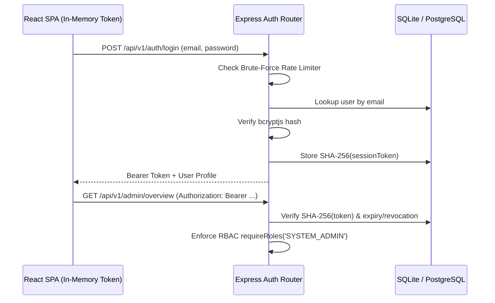

# Authentication & Authorization Architecture

```mermaid
sequenceDiagram
  participant Client as React SPA (In-Memory Token)
  participant API as Express Auth Router
  participant DB as SQLite / PostgreSQL

  Client->>API: POST /api/v1/auth/login (email, password)
  API->>API: Check Brute-Force Rate Limiter
  API->>DB: Lookup user by email
  API->>API: Verify bcryptjs hash
  API->>DB: Store SHA-256(sessionToken)
  API-->>Client: Bearer Token + User Profile
  Client->>API: GET /api/v1/admin/overview (Authorization: Bearer ...)
  API->>DB: Verify SHA-256(token) & expiry/revocation
  API->>API: Enforce RBAC requireRoles('SYSTEM_ADMIN')
```
